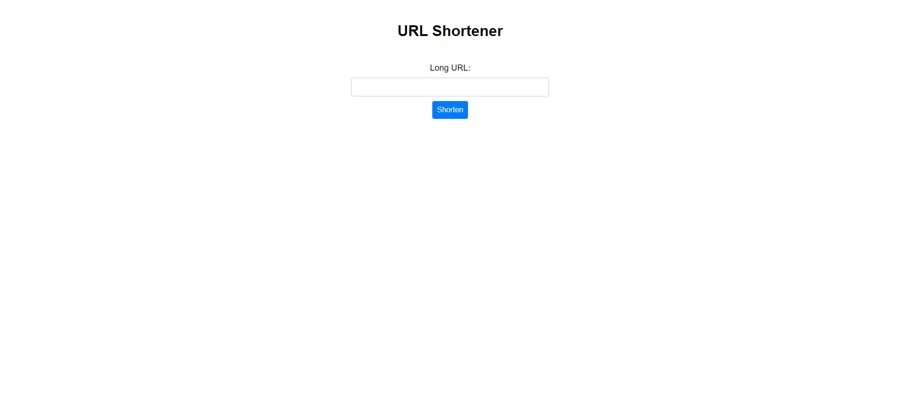

# DevProjects - Link shortener website

This is an open source project from [DevProjects](http://www.codementor.io/projects). Feedback and questions are welcome!
Find the project requirements here: [Link shortener website](https://www.codementor.io/projects/web/link-shortener-website-brqjanf6zq)

## Tech/framework used
Built with HTML,CSS , Javascript and Bitly API.

## Screenshots and demo
Design View: 
Live Demo : https://linkshortnerwebsite.netlify.app/
            https://harshi0102.github.io/Linkshortnerwebsite/
## Installation
Instructions for other developers on how to install and run your code on their local environment.
Clone the repository: https://github.com/harshi0102/Linkshortnerwebsite.git

Create a .env file and add your Bitly access token:
BITLY_ACCESS_TOKEN=your-access-token-here

npm start
Open your browser and go to http://localhost:3000 to view the website.
## License
This Project is [MIT](https://github.com/harshi0102/Linkshortnerwebsite/blob/main/LICENSE) licensed.
